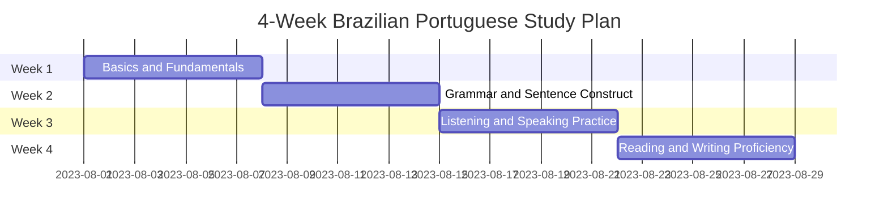

**Learn a language in 4 weeks, adjusted plan 🇧🇷**

Learning a language in just four weeks can be challenging, but with a focused study plan and consistent effort, you can make significant progress. Keep in mind that language learning is an ongoing process, and four weeks will provide a foundation for further improvement. Below is a 4-week study plan to learn Brazilian Portuguese (or any other language):

> My personal goal is: Brasilian, Italian, German since I already know english {: .prompt-info }

**Week 1: Basics and Fundamentals**

- **Time Commitment:** 1-2 hours daily

- **Resources:**

  1. Duolingo or Memrise for basic vocabulary and sentence structures.
  2. YouTube videos or online tutorials for pronunciation practice.
  3. Anki or Quizlet for flashcards to reinforce vocabulary.
- **Study Plan:**

  - Days 1-3: Focus on greetings, basic phrases, and introductions.
  - Days 4-6: Learn numbers, colors, and essential everyday vocabulary.
  - Days 7: Review and reinforce what you've learned during the week.

**Week 2: Grammar and Sentence Construction**

- **Time Commitment:** 1-2 hours daily

- **Resources:**

  1. Language learning apps with structured lessons.
  2. Online grammar guides for Brazilian Portuguese.
  3. Language exchange platforms to practice speaking with native speakers.
- **Study Plan:**

  - Days 8-12: Study grammar rules for verb conjugation (present tense) and sentence structure.
  - Days 13-14: Practice simple conversations and basic questions with a language partner or tutor.

**Week 3: Listening and Speaking Practice**

- **Time Commitment:** 1-2 hours daily

- **Resources:**

  1. Brazilian movies, TV shows, or podcasts with subtitles.
  2. Language exchange partners for regular speaking practice.
  3. Language learning apps with listening exercises.
- **Study Plan:**

  - Days 15-17: Focus on improving listening skills with audio content.
  - Days 18-21: Engage in speaking practice regularly, focusing on fluency rather than perfection.

**Week 4: Reading and Writing Proficiency**

- **Time Commitment:** 1-2 hours daily

- **Resources:**

  1. Short stories or articles in Brazilian Portuguese.
  2. Language exchange platforms for written communication with native speakers.
  3. Language learning apps with reading comprehension exercises.
- **Study Plan:**

  - Days 22-24: Read and comprehend short texts, focusing on new vocabulary and expressions.
  - Days 25-27: Practice writing short paragraphs or journal entries in Brazilian Portuguese.
  - Day 28: Review all aspects of your learning and identify areas for further improvement.

**Tips:**

1. **Consistency is key:** Dedicate time every day to practice and reinforce your learning.
2. **Immerse yourself:** Surround yourself with Brazilian Portuguese content, like music, movies, and podcasts.
3. **Set realistic goals:** Understand that fluency won't be achieved in four weeks, but aim to build a strong foundation.
4. **Interact with native speakers:** Engaging with native speakers will help you gain practical experience.

Remember, language learning is a journey, and it's important to enjoy the process. After the initial four weeks, continue practicing and expanding your knowledge to become more proficient in Brazilian Portuguese.