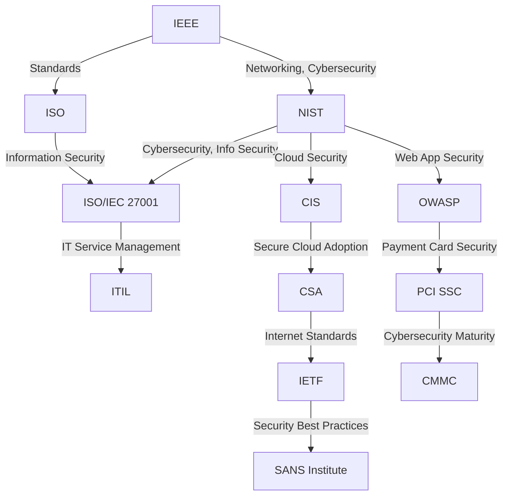
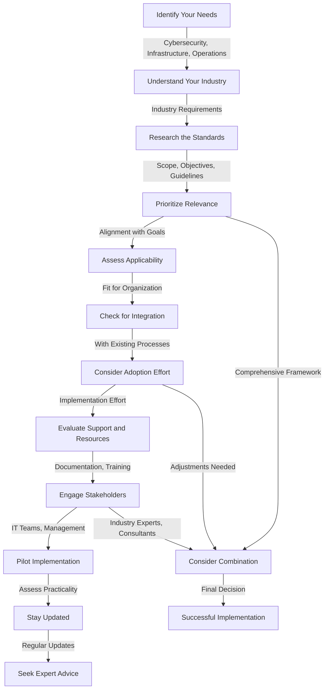

# **Exploring Key Organizations Setting Technology Standards for a Secure Future**

In our rapidly evolving digital landscape, technology standards play a pivotal role in ensuring security, optimizing operations, and streamlining infrastructure deployment. Several esteemed organizations are at the forefront of shaping these standards, guiding industries towards robust practices. Let's dive into a few of these influential entities and their areas of expertise.

1. **IEEE (Institute of Electrical and Electronics Engineers):** IEEE is a driving force in establishing standards that touch every corner of technology. From wireless networking (Wi-Fi) to cybersecurity, IEEE offers guidelines that underpin our interconnected world.

2. **NIST (National Institute of Standards and Technology):** NIST, a U.S. government agency, focuses on cybersecurity and information security standards. Their comprehensive NIST Special Publication 800 series covers a wide spectrum, addressing risk management, cryptography, and more.

3. **ISO (International Organization for Standardization):** ISO provides a global perspective on technology standards. ISO/IEC 27001, for instance, sets the bar for information security management systems (ISMS), ensuring organizations adhere to stringent security practices.

4. **CIS (Center for Internet Security):** CIS excels in crafting security best practices, benchmarks, and guidelines. The CIS Controls and CIS Benchmarks are invaluable resources for safeguarding systems and data.

5. **OWASP (Open Web Application Security Project):** OWASP zeroes in on web application security. Their OWASP Top Ten identifies critical security risks, guiding developers and security professionals in securing web applications.

6. **IETF (Internet Engineering Task Force):** IETF's impact extends across the internet's fabric. Responsible for developing and promoting internet standards, they tackle networking, protocols, and operational challenges.

7. **Cloud Security Alliance (CSA):** As the cloud computing landscape expands, CSA takes the lead in cloud security. Their guidance, best practices, and frameworks aid organizations in adopting and maintaining secure cloud environments.

8. **PCI SSC (Payment Card Industry Security Standards Council):** Ensuring safe payment card information handling is the core of PCI SSC's work. The Payment Card Industry Data Security Standard (PCI DSS) sets the bar for secure transactions.

9. **ITIL (Information Technology Infrastructure Library):** For impeccable IT service management, ITIL is the go-to resource. Their best practices empower organizations to streamline IT services and operations.

10. **NIST Cybersecurity Framework:** A widely adopted framework, it helps organizations manage and reduce cybersecurity risks, fostering a safer digital ecosystem.

11. **CMMC (Cybersecurity Maturity Model Certification):** Geared towards U.S. Department of Defense contractors, CMMC defines cybersecurity maturity levels and practices, ensuring protection of sensitive information.

12. **SANS Institute:** Offering a plethora of resources, including security training and system administration guidelines, SANS Institute strengthens organizations against emerging threats.

These organizations collectively shape the technological landscape, ensuring that security, infrastructure deployment, and operations are well-aligned with industry best practices. In a world where technology's pace is relentless, these standards provide a reliable compass for navigating the digital realm securely and effectively.

# Which one to use? or how to pick one?

Selecting the right set of technology standards for your purposes depends on your specific goals, industry, and the nature of your projects. Here's a step-by-step guide to help you pick the most relevant standards:

1. **Identify Your Needs:**
   Determine the specific areas where you need standards. Are you focusing on cybersecurity, infrastructure deployment, operations, or something else? Having a clear understanding of your requirements will narrow down your choices.

2. **Understand Your Industry:**
   Different industries have varying regulatory requirements and best practices. Research the standards commonly adopted within your industry to ensure compliance and alignment with industry norms.

3. **Research the Standards:**
   Once you know your needs and industry requirements, research the standards provided by the relevant organizations. Understand the scope, objectives, and guidelines outlined in each standard.

4. **Prioritize Relevance:**
   Consider the relevance of each standard to your specific projects and goals. Some standards might align better with your immediate needs, while others might provide a more comprehensive framework.

5. **Assess Applicability:**
   Evaluate how well each standard fits your organization's size, structure, and capabilities. Some standards might be more suitable for larger enterprises, while others could be tailored for small and medium-sized businesses.

6. **Check for Integration:**
   If you're already using certain tools, frameworks, or methodologies, check whether the standards seamlessly integrate with your existing processes. This can reduce disruption and facilitate implementation.

7. **Consider Adoption Effort:**
   Assess the effort required to implement the chosen standard. Some standards might require significant changes to your processes, while others could be more adaptable to your current setup.

8. **Evaluate Support and Resources:**
   Look into the availability of support materials, documentation, training, and resources related to each standard. Adequate resources can make the implementation process smoother.

9. **Engage Stakeholders:**
   Involve relevant stakeholders, including IT teams, security experts, and management, in the decision-making process. Their insights and perspectives can help you make an informed choice.

10. **Pilot Implementation:**
    Consider starting with a pilot implementation of the chosen standard to assess its practicality and impact. This can help you identify any challenges or adjustments needed before full-scale adoption.

11. **Stay Updated:**
    Technology and security landscapes evolve over time. Ensure that the chosen standards are regularly updated to address emerging threats and challenges.

12. **Seek Expert Advice:**
    If you're unsure about which standards to choose, consider consulting with industry experts, consultants, or professionals who specialize in the relevant domains. They can provide valuable insights based on their experience.

Remember that you might not need to adopt a single standard exclusively. Depending on your organization's complexity and needs, a combination of standards could offer the best solution. Flexibility and a willingness to adapt are key as you navigate the world of technology standards to enhance security, operations, and infrastructure deployment in your organization.

# Common Q&A to select a standard

**Q1: What factors should I consider when choosing a technology standard?**
- **Answer:** When choosing a technology standard, consider factors such as your industry, regulatory requirements, organizational goals, existing processes, and the specific area (security, infrastructure, operations) you need the standard for.

**Q2: How do I know if a standard aligns with my industry's regulations?**
- **Answer:** Research the standards widely adopted within your industry. For example, if you're in the financial sector, Payment Card Industry Data Security Standard (PCI DSS) could be crucial for handling payment card data securely.

**Q3: How can I ensure a standard is relevant to my organization's goals?**
- **Answer:** Prioritize standards that address your organization's immediate needs. If you're a healthcare provider, consider Health Insurance Portability and Accountability Act (HIPAA) compliance standards to protect patient data.

**Q4: Should I opt for a single standard or a combination of standards?**
- **Answer:** It depends on your organization's complexity and needs. For instance, if you're a software development company, you might benefit from combining ISO/IEC 27001 (information security) with OWASP Top Ten (web application security) for comprehensive coverage.

**Q5: How much effort is required to implement a specific standard?**
- **Answer:** Evaluate the effort required for implementation. ISO/IEC 27001, for instance, might require substantial changes to information security practices, while adopting specific OWASP guidelines might be relatively easier.

**Q6: What if a standard doesn't seamlessly integrate with our existing processes?**
- **Answer:** Consider standards that align with your current tools and processes. For example, if your organization heavily relies on Microsoft technologies, you might prioritize standards that work well within the Microsoft ecosystem.

**Q7: How can I ensure ongoing support and resources for implementing a standard?**
- **Answer:** Choose standards from reputable organizations that provide comprehensive resources. For instance, ISO/IEC 27001 has well-documented guidance and frameworks available.

**Q8: How do I involve stakeholders in the decision-making process?**
- **Answer:** Engage IT teams, security experts, and management in discussions about standard selection. Their input is crucial for finding a suitable fit. For instance, IT teams might prefer standards that align with their technical capabilities.

**Q9: Can I pilot-test a standard before full-scale implementation?**
- **Answer:** Yes, consider piloting the implementation of a standard to assess its practicality and effectiveness. For instance, you could pilot a few ISO/IEC 27001 controls within a specific department before rolling them out organization-wide.

**Q10: How do I stay updated with evolving technology and security landscapes?**
- **Answer:** Opt for standards that undergo regular updates. ISO/IEC 27001 and NIST Cybersecurity Framework are examples of standards that evolve to address emerging threats and challenges.

**Q11: What if I'm uncertain about which standards to choose?**
- **Answer:** Seek advice from industry experts or consultants. They can provide insights based on their experience. For instance, a cybersecurity consultant might guide you on choosing standards that best align with your organization's security goals.

Remember that each organization's needs are unique, so tailor your standard selection process to your specific context. These questions and answers serve as a starting point to help you navigate the decision-making process effectively.

# References

1. **IEEE (Institute of Electrical and Electronics Engineers):** [https://www.ieee.org/](https://www.ieee.org/)
2. **NIST (National Institute of Standards and Technology):** [https://www.nist.gov/](https://www.nist.gov/)
3. **ISO (International Organization for Standardization):** [https://www.iso.org/](https://www.iso.org/)
4. **CIS (Center for Internet Security):** [https://www.cisecurity.org/](https://www.cisecurity.org/)
5. **OWASP (Open Web Application Security Project):** [https://owasp.org/](https://owasp.org/)
6. **IETF (Internet Engineering Task Force):** [https://www.ietf.org/](https://www.ietf.org/)
7. **Cloud Security Alliance (CSA):** [https://cloudsecurityalliance.org/](https://cloudsecurityalliance.org/)
8. **PCI SSC (Payment Card Industry Security Standards Council):** [https://www.pcisecuritystandards.org/](https://www.pcisecuritystandards.org/)
9. **ITIL (Information Technology Infrastructure Library):** [https://www.axelos.com/best-practice-solutions/itil](https://www.axelos.com/best-practice-solutions/itil)
10. **NIST Cybersecurity Framework:** [https://www.nist.gov/cyberframework](https://www.nist.gov/cyberframework)
11. **CMMC (Cybersecurity Maturity Model Certification):** [https://www.acq.osd.mil/cmmc/index.html](https://www.acq.osd.mil/cmmc/index.html)
12. **SANS Institute:** [https://www.sans.org/](https://www.sans.org/)
