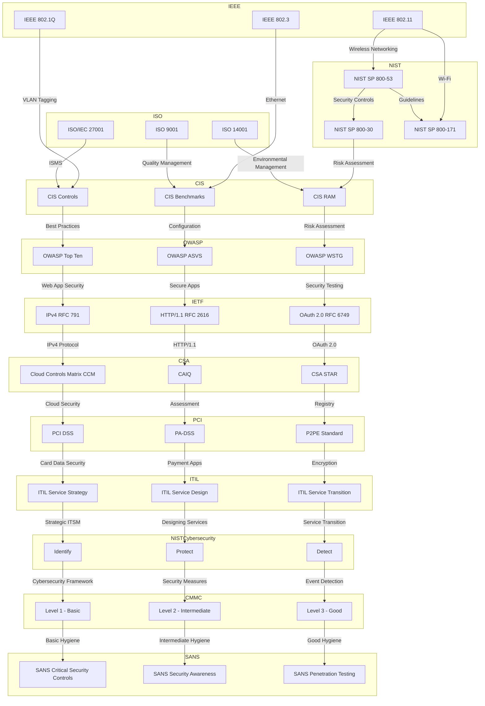

# **Exploring Key Standards for Standarization institutes**

# Common standards list

Here are three common standards associated with each of the institutions mentioned earlier:

**IEEE (Institute of Electrical and Electronics Engineers):**
1. **IEEE 802.11:** This standard pertains to wireless networking, commonly known as Wi-Fi.
2. **IEEE 802.1Q:** A standard for Virtual LAN (VLAN) tagging and Ethernet frame format.
3. **IEEE 802.3:** This is the Ethernet standard that defines wired networking protocols.

**NIST (National Institute of Standards and Technology):**
1. **NIST Special Publication 800-53:** This publication provides security controls and guidelines for federal information systems.
2. **NIST Special Publication 800-30:** A guide for conducting risk assessments.
3. **NIST Special Publication 800-171:** Focuses on protecting Controlled Unclassified Information (CUI) in non-federal systems and organizations.

**ISO (International Organization for Standardization):**
1. **ISO/IEC 27001:** An international standard for information security management systems (ISMS).
2. **ISO 9001:** A standard for quality management systems in various industries.
3. **ISO 14001:** Focuses on environmental management systems.

**CIS (Center for Internet Security):**
1. **CIS Controls:** A set of best practices for improving cybersecurity posture.
2. **CIS Benchmarks:** Configuration guidelines for various systems and applications to enhance security.
3. **CIS RAM:** A risk assessment method to help organizations measure their cybersecurity risks.

**OWASP (Open Web Application Security Project):**
1. **OWASP Top Ten:** An annually updated list of the most critical web application security risks.
2. **OWASP Application Security Verification Standard (ASVS):** A framework for building secure applications and web services.
3. **OWASP Web Security Testing Guide (WSTG):** A comprehensive guide for web application security testing.

**IETF (Internet Engineering Task Force):**
1. **RFC 791 (IPv4):** The standard that defines the IPv4 protocol.
2. **RFC 2616 (HTTP/1.1):** The specification for the HTTP/1.1 protocol used on the World Wide Web.
3. **RFC 6749 (OAuth 2.0):** Describes the OAuth 2.0 authorization framework.

**Cloud Security Alliance (CSA):**
1. **Cloud Controls Matrix (CCM):** A framework for aligning cloud security controls with industry standards and regulations.
2. **Consensus Assessments Initiative Questionnaire (CAIQ):** A set of questions for cloud providers to showcase their security capabilities.
3. **CSA Security, Trust & Assurance Registry (STAR):** A registry of cloud provider security controls and assessment reports.

**PCI SSC (Payment Card Industry Security Standards Council):**
1. **Payment Card Industry Data Security Standard (PCI DSS):** Defines security requirements for protecting payment card data.
2. **Payment Application Data Security Standard (PA-DSS):** Focuses on securing payment applications.
3. **Point-to-Point Encryption (P2PE) Standard:** Provides guidance for secure cardholder data encryption.

**ITIL (Information Technology Infrastructure Library):**
1. **ITIL Service Strategy:** Focuses on strategic aspects of IT service management.
2. **ITIL Service Design:** Deals with designing effective IT services and processes.
3. **ITIL Service Transition:** Addresses the transition of services into production.

**NIST Cybersecurity Framework:**
1. **Identify:** Identifying and managing cybersecurity risks.
2. **Protect:** Safeguarding systems, data, and assets.
3. **Detect:** Detecting and responding to cybersecurity events.

**CMMC (Cybersecurity Maturity Model Certification):**
1. **Level 1 - Basic Cyber Hygiene:** Focuses on safeguarding federal contract information (FCI).
2. **Level 2 - Intermediate Cyber Hygiene:** Includes more specific practices for safeguarding CUI.
3. **Level 3 - Good Cyber Hygiene:** Introduces additional practices for managing CUI.

**SANS Institute:**
1. **SANS Critical Security Controls:** A prioritized set of actions to improve an organization's cybersecurity posture.
2. **SANS Security Awareness:** Offers training and resources to raise security awareness among employees.
3. **SANS Penetration Testing:** Provides methodologies and techniques for ethical hacking and security testing.

